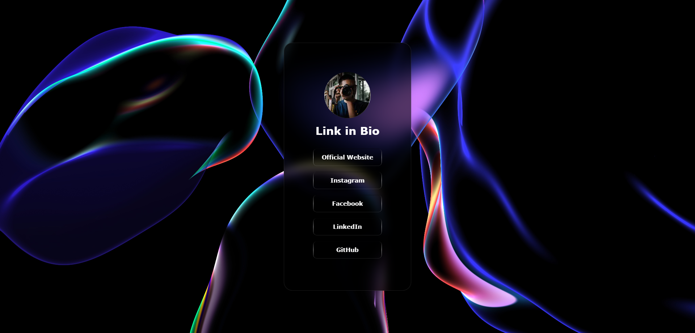

# Link in BIO

<!--  -->


## 📖 About

This website is designed to display your links in bio for Instagram or other social media platforms.

## 🛠️ How to Use

### 1. Fork this Repository 🍴

Click the "Fork" button at the top right of this repository page to create a copy of this repository under your own GitHub account.

### 2. Clone Your Forked Repository 🖥️

Clone the repository to your local machine using the following command:

```bash
git clone https://github.com/YOUR-USERNAME/LINK-IN-BIO.git
```

Replace `YOUR-USERNAME` with your GitHub username.

### 3. Edit `app/data.json` File ✏️

Navigate to the `app` directory and edit the `data.json` file to customize your links.

```bash
cd LINK-IN-BIO/app

vim data.json # or use any other text editor like nano, code, etc.
```

### 4. Commit and Push Your Changes 📤

After editing the `data.json` file, commit and push your changes back to your GitHub repository.

```bash
# Stage your changes
git add app/data.json

# Commit your changes
git commit -m "docs: update data.json 📑"

# Push to your forked repository
git push origin main
```

## Built With 🛠️

- [Next.js](https://nextjs.org/) - A React framework for production.
- [Tailwind CSS](https://tailwindcss.com/) - A utility-first CSS framework.
- [Vercel](https://vercel.com/) - A cloud platform for static sites and serverless functions.
- [React Spring](https://react-spring.dev/) - A spring-physics-based animation library for React.

> [!TIP]
> Video tag is not supported in Safari browser. You can use [ReactPlayer](https://www.npmjs.com/package/react-player) to embed videos. (In the future I will do)

## License 📄

This project is licensed under the MIT License. See the [LICENSE](LICENSE) file for details.
